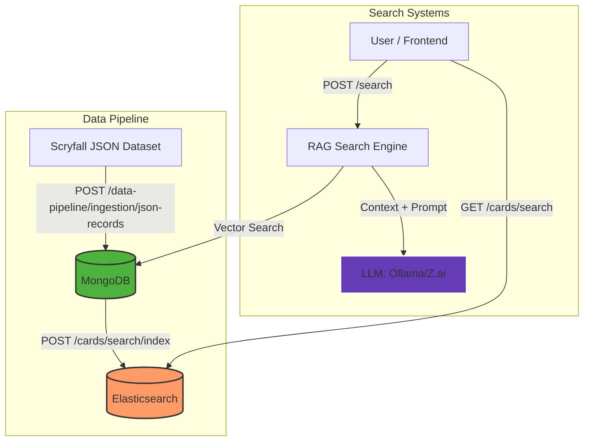

# Card Oracle

Monorepo for a multi-purpose RAG and search project for Magic: The Gathering cards.

## System Architecture

The application combines a traditional search system (Elasticsearch) with an AI-powered RAG system (MongoDB Vector Search) to provide both structured filtering and natural language understanding.



### Core Components

1.  **MongoDB (Source of Truth)**: Stores the complete card dataset and pre-computed vector embeddings for RAG.
2.  **Elasticsearch (Search Engine)**: Powering fast, fuzzy name matching and structured filtering (CMC, Set, Date).
3.  **RAG Search**: A natural language interface that retrieves relevant card context from MongoDB using vector similarity and generates answers via an LLM.

## Features

### Fast Card Search (New)
- **Fuzzy Matching**: Find cards even with typos (e.g., "Ligtning Bolt").
- **Structured Filters**: Filter by Converted Mana Cost (CMC), Set code, and Release Date.
- **Dedicated Indexing**: Sync your search index directly from MongoDB with a dedicated endpoint.

### RAG Search powered by LLMs
- **Natural Language**: Ask complex questions like "Which cards deal 3 damage for 1 mana?".
- **Supported Providers**: Ollama (Local), Llama.cpp (Local), Z.ai (Cloud).
- **Vector Search**: Semantic retrieval using sentence-transformers or OpenAI embeddings.

## Development Workflow

### 1. Initial Data Ingestion
Load the Scryfall JSON dataset into MongoDB:
```bash
# Example using curl to the local backend
curl -X POST "http://localhost:8000/data-pipeline/ingestion/json-records" \
     -F "file=@scryfall-default-cards.json" \
     -F "collection=cards"
```

### 2. Indexing for Search
Once data is in MongoDB, sync it to Elasticsearch for the search feature:
```bash
curl -X POST "http://localhost:8000/cards/search/index"
```

### 3. Creating Embeddings (for RAG)
Generate vector embeddings to enable natural language search:
```bash
curl -X POST "http://localhost:8000/embeddings/generate" \
     -d '{"collection": "cards"}'
```

## Setup & Deployment

### Build with Docker
The easiest way to get the full stack (Next.js, FastAPI, MongoDB, Elasticsearch) running:

```bash
docker-compose up -d --build
```

Verify MongoDB Replica Set status (required for vector search):
```bash
docker-compose exec db mongosh --eval "rs.status()"
```

### Local Development

#### Frontend (Next.js)
1. Install `bun`
2. `bun install && bun dev`

#### Backend (FastAPI)
1. Install `uv`
2. `uv sync && fastapi dev app/main.py`

## Test chunk mappings

```
name: {name}. Summary: {oracle_text}. Type: {type_line}. 
```
