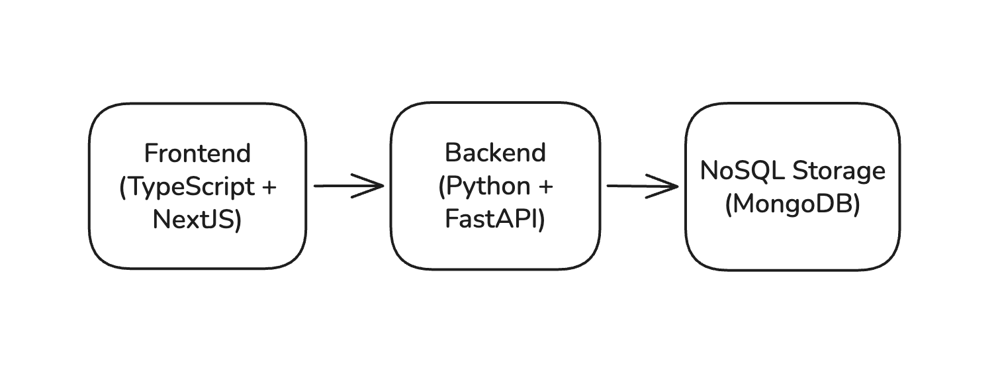

# Card Oracle backend

An application that lets users retrieve data about Magic: The Gathering cards




## Development Setup

### Environment

- Python `3.12`
- MongoDB `8.2+` (Vector Search)
- Mongo Atlas CLI `1.52`
- One LLM provider:
  - Ollama (`ollama`) for local inference
  - Z.ai (`zai`) for hosted inference
- Huggingface for transformers (via `uvx hf`)

#### Transformer LLMs

I'm using the [SentenceTransformers](https://sbert.net/) package.

Constraints:

- Transformer dimensions: `384`
- Reasoning: The most relevant piece of information (oracle_text) is not long enough to require bigger dimensions

Models:

- `mixedbread-ai/mxbai-embed-xsmall-v1`. Results have been OK.
- `sentence-transformers/all-MiniLM-L6-v2`. Results have been better thn mxbai, faster on my M1 Pro.

```bash
uvx hf auth login
uvx hf download <model> --local-dir models/<model>
```

#### RAG LLMs

The backend requires `LLM_PROVIDER` to be explicitly set. See `docs/llms` on the root directory for more information on setups.

`LLM_MODEL_NAME` is the model identifier.

### Installation

1. Install `uv`
2. Install Python: `uv python install`

```bash
uv venv
source .venv/bin/activate
uv sync
```

**Note:** This backend connects to MongoDB. There's a bunch of things to setup, and it's easy to screw the setup... Please use `docker compose` instead!

### Development

Run the FastAPI server:

```bash
> fastapi dev app/main.py
```

Navigate to `localhost:8000/docs` and use the endpoints there :)
