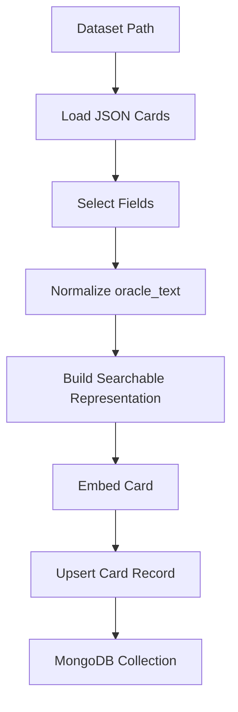
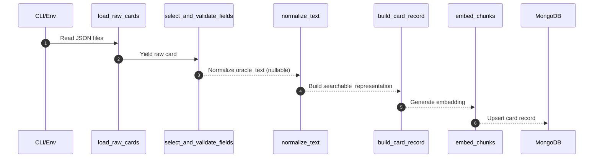

# Embeddings Pipeline Overview

This document summarizes how `scripts/create_embeddings.py` works, including key stages, data flow, and storage behavior.

## High-Level Summary
The script loads Scryfall card JSON, normalizes `oracle_text`, builds a single searchable representation per card, generates one embedding per card, and upserts the result into MongoDB. Cards without `oracle_text` are still embedded using the other fields; `oracle_text` is stored as `null` in MongoDB.

## Architecture Diagram

## Detailed Flow

## Key Functions

- `load_raw_cards()`
  - Reads JSON files from the dataset path and yields card dicts.
- `select_and_validate_fields()`
  - Extracts `oracle_text`, `flavor_text`, `prices.usd`, `cmc`, `mana_cost`, `set_name`, and identifiers.
  - Treats missing or blank `oracle_text` as `None` (no longer skipped).
- `normalize_text()`
  - Collapses whitespace, preserves MTG symbols.
- `build_searchable_representation()`
  - Produces a single semantic string that ties together name, type, cost, mana value, abilities, flavor, and price.
  - Adds keyword enrichment like “Mana Value” alongside CMC.
- `build_card_record()`
  - Creates one MongoDB record per card with `searchable_representation` and metadata.
- `embed_chunks()`
  - Embeds the `searchable_representation` and attaches embedding metadata.
- `upsert_embeddings()`
  - Bulk upserts into MongoDB by `_id`.

## Storage Behavior

- One record per card.
- `_id` is the Scryfall card `id`.
- `searchable_representation` contains the semantic string that is embedded.
- `oracle_text` is stored as `null` when missing, but embeddings still exist.

## Operational Notes

- Uses `.env` for configuration (`MONGODB_URI`, model name/path, batch sizes).
- If GPU is available, uses `cuda`; otherwise falls back to CPU.
- Logs batch progress and totals to stdout.
