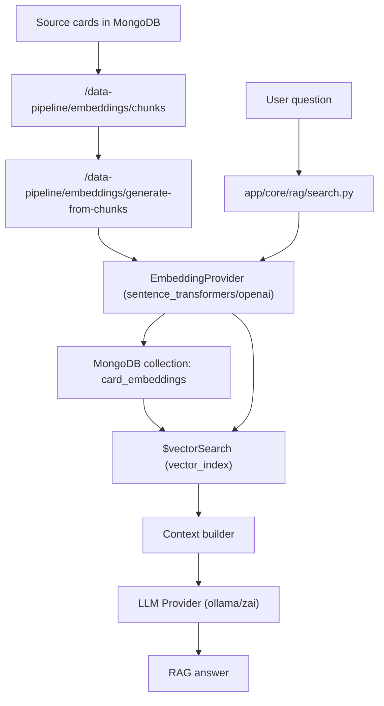

# RAG Search System

This repository implements a RAG flow for Magic: The Gathering card data with provider-agnostic embedding generation.

## End-to-End Flow

## Embedding Providers

Embeddings are generated through a shared interface selected by `EMBEDDING_PROVIDER`:

- `sentence_transformers` (default, local)
- `openai` (hosted)

Both ingestion and query-time embedding use the same provider abstraction.

### Dimensions

- Dimensions are configured globally via `EMBEDDING_MODEL_DIMENSIONS`.
- For OpenAI, dimensions are sent using the embeddings API `dimensions` parameter.
- Providers validate output vector size and fail fast on mismatches.
- MongoDB vector index creation uses the same configured dimensions.

### Normalization

- Query and ingestion support normalization (`normalize_embeddings` controls this in API flows).
- OpenAI normalization uses L2 normalization in app code when enabled.

## Similarity Recommendation

Use `cosine` similarity for vector search indexes and retrieval scoring behavior.

## Configuration

Key environment variables:

- `MONGODB_URI`
- `MONGODB_DB`
- `MONGODB_CARD_EMBEDDINGS_COLLECTION`
- `EMBEDDING_PROVIDER` (`sentence_transformers` | `openai`)
- `EMBEDDING_MODEL_NAME`
- `EMBEDDING_MODEL_PATH` (ignored by OpenAI)
- `EMBEDDING_MODEL_DIMENSIONS`
- `EMBEDDING_VECTOR_SEARCH_LIMIT`
- `LLM_PROVIDER` (`ollama` | `zai`)
- `LLM_MODEL_NAME`
- `LLM_TIMEOUT_SECONDS`
- `LLM_ENDPOINT` (optional)
- `LLM_API_KEY`

Legacy aliases still accepted:

- `EMBEDDING_TRANSFORMER_MODEL_NAME`
- `EMBEDDING_TRANSFORMER_MODEL_PATH`
- `EMBEDDING_TRANSFORMER_MODEL_DIMENSIONS`

## OpenAI Credential Note

OpenAI embeddings currently reuse `LLM_API_KEY` and optional `LLM_ENDPOINT` as `base_url`.
This means mixed remote-provider keys (for example, Z.ai LLM + OpenAI embeddings with different API keys) are not supported in this pass.
