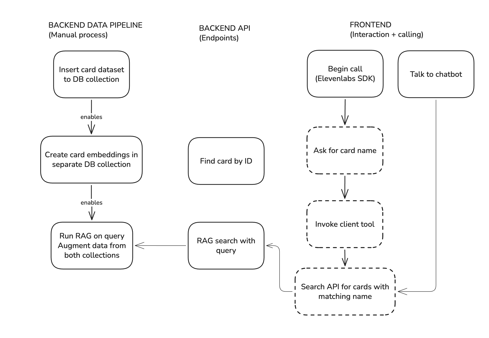
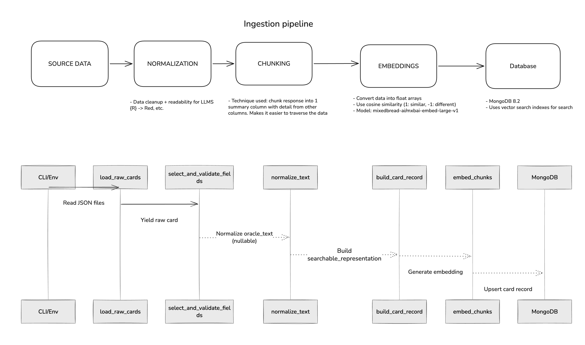

# Card Oracle backend

An application that lets users retrieve data about Magic: The Gathering cards




## Development Setup

### Environment

- Python `3.12`
- MongoDB `8.2+` (Vector Search)
- Mongo Atlas CLI `1.52`
- Ollama for LLM models (`ollama`)
- Huggingface for transformers (via `uvx hf`)

#### Transformer LLMs

I'm [SentenceTransformers](https://sbert.net/) package.

Constraints:

- Transformer dimensions: `384`
- Reasoning: The most relevant piece of information (oracle_text) is not long enough to require bigger dimensions

Models:

- `mixedbread-ai/mxbai-embed-xsmall-v1`. Results have been OK - Need more testing
- `sentence-transformers/all-MiniLM-L6-v2`. Currently testing this model - unsure how good results will be.

```bash
uvx hf auth login
uvx hf download <model> --local-dir models/<model>
```

#### RAG LLMs

- Model: `mistral:7b` (via Ollama)

Install:

```bash
ollama run mistral
```

### Installation

1. Install `uv`
2. Install Python: `uv python install 3.12`
3. Install [MongoDB 8.2](https://www.mongodb.com/docs/manual/administration/install-community/?operating-system=macos&macos-installation-method=homebrew). 8.2 has vector database support so this is the minimal version required.
4. Create a Mongo atlas: `atlas local setup`. Choose `Connection string` as the interaction method.
5. Add the connection string to `MONGODB_URI` in `.env`
6. Setup `EMBED_MODEL` in `.env` with the location of your installed model: `models/<model>`

```bash
uv venv
source .venv/bin/activate
uv pip install -r requirements.txt
```

### MongoDB setup

`atlas` cli is required in order to use vector search. Here's a local setup:

```bash
> atlas local setup
> Mongo version: latest
> Name: cards-oracle
Successfully setup deployment 'cards-oracle'
MongoDB version: 8.2.4
Port: <PORT>
Load sample data: false
Connected via: Compass
```

Set `MONGODB_URI` port to the `<PORT>` obtained in the output above

Connect to the cluster manually:

```bash
> atlas deployments connect
choose "cards-oracle"
```

### Development

Run the FastAPI server:

```bash
fastapi dev app/main.py
```

## Datasets

- Source: [Scryfall](https://scryfall.com/docs/api/bulk-data)

## Data Pipeline

### 1. Ingestion



#### 1.1 Dataset into MongoDB

Load the JSON response into a collection. We will use this later for API endpoints and extra augmentation.

```bash
python -m app.data_pipeline.ingest_dataset
```

#### 1.2 Create vector search embeddings w/ chunking

Run embeddings with 50 entries just to verify it all works well

```bash
python -m app.data_pipeline.create_embeddings
```

This will take ~15-30 seconds.

Then connect to Mongo via CLI and query the database:

```bash
> mongosh
> use mtg
> db.cards.find()
{
  "_id": "a471b306-4941-4e46-a0cb-d92895c16f8a",
  "object": "card",
  "oracle_id": "00037840-6089-42ec-8c5c-281f9f474504",
  "multiverse_ids": [
    692174
  ],
  "mtgo_id": 137223,
  "tcgplayer_id": 615195,
  "cardmarket_id": 807933,
  "name": "Nissa, Worldsoul Speaker",
  ...
}
> db.card_embeddings.find()
{
  "_id": "a471b306-4941-4e46-a0cb-d92895c16f8a",
  "source_id": "a471b306-4941-4e46-a0cb-d92895c16f8a",
  "summary": "Card Name: Nissa, Worldsoul Speaker. Type: Legendary Creature — Elf Druid. Cost: 3 G (CMC 4.0) (Mana Value 4.0). Abilities: Landfall — Whenever a land you control enters, you get E E (two energy counters). You may pay eight E rather than pay the mana cost for permanent spells you cast.. Flavor: \"Zendikar still seems so far off, but Chandra is my home.\". Current Price: $0.17 USD.",
  "embeddings": [...384 entries here...],
  "created_at": {
    "$date": "2026-02-08T09:40:42.662Z"
  }
}
```

If the above went right, you're ready to run the entire ingestion pipeline:

```bash
> python -m app.data_pipeline.create_embeddings
```

Note: This will take anywhere around 10 minutes on a Macbook with no GPU.

Note: If you need to delete the index:

```bash
atlas local search indexes delete --deploymentName cards-oracle
> Database? db
> Collection? card_embeddings
> Search Index Name? vector_index
> Are you sure you want to delete search index 'vector_index'? Yes
Index 'vector_index' deleted
```

### 2. Retrieval


Use the local Sentence Transformers embedder for the query, run vector search, and have Ollama answer with retrieved context:

```bash
> python -m app.core.rag.search "Which cards care about Phyrexians?"
2026-02-09 21:03:36,349 INFO Loading embedding model from path: models/sentence-transformers/all-MiniLM-L6-v2 (device=cpu)
"...Output from transformer setup..."
2026-02-09 21:03:50,870 INFO HTTP Request: POST http://127.0.0.1:11434/api/generate "HTTP/1.1 200 OK"
2026-02-09 21:03:50,875 INFO Top 5 results:
2026-02-09 21:03:50,875 INFO
Card Name: Phyrexian Obliterator // Phyrexian Obliterator. Type: Card // Card. Set: Phyrexia: All Will Be One Art Series. (CMC or mana value 0.0). Abilities: None.
2026-02-09 21:03:50,875 INFO
Card Name: Prologue to Phyresis. Type: Instant. Set: Phyrexia: All Will Be One. Cost: 1 U (CMC or mana value 2.0). Abilities: Each opponent gets a poison counter. Draw a card..
2026-02-09 21:03:50,875 INFO
Card Name: Long-Term Phyresis Study. Type: Enchantment. Set: Unknown Event. Cost: 2 B (CMC or mana value 3.0). Abilities: Poison Tolerance +1 (It takes an additional poison counter for you to lose the game to poison.) When Long-Term Phyresis Study enters the battlefield, return up to one target creature card from your graveyard to your hand. Then, draw a card..
2026-02-09 21:03:50,875 INFO
Card Name: Strictly Better // Strictly Better (cont'd). Type: Card // Card. Set: Phyrexia: All Will Be One Minigames. (CMC or mana value 0.0). Abilities: None.
2026-02-09 21:03:50,875 INFO
Card Name: Phyrexian Beast. Type: Token Creature — Phyrexian Beast. Set: Phyrexia: All Will Be One Tokens. (CMC or mana value 0.0). Abilities: Toxic 1 (Players dealt combat damage by this creature also get a poison counter.).

---
RAG Response
---
In the provided context, the cards that care about Phyrexians are: 1. Phyrexian Obliterator // Phyrexian Obliterator: This card is a Phyrexian card. 2. Phyrexia: All Will Be One Art Series (Set): This set includes the Phyrexian Obliterator card, suggesting it might have more Phyrexian cards. 3. Prologue to Phyresis: While not explicitly a Phyrexian card, it is from the Phyrexia: All Will Be One set and causes opponents to get poison counters, which is a mechanism often associated with Phyrexians. 4. Long-Term Phyresis Study: This enchantment gives Poison Tolerance +1, which can be seen as caring about Phyrexians due to the association of Phyrexians with poison counters. 5. Phyrexia: All Will Be One Tokens (Set): This set includes tokens like Phyrexian Beast that have the Toxic ability, which deals poison counter damage. 6. Strictly Better // Strictly Better (cont'd): While not explicitly a Phyrexian card, it is from the Phyrexia: All Will Be One Minigames set, suggesting it might be related to Phyrexians in some way.
```
