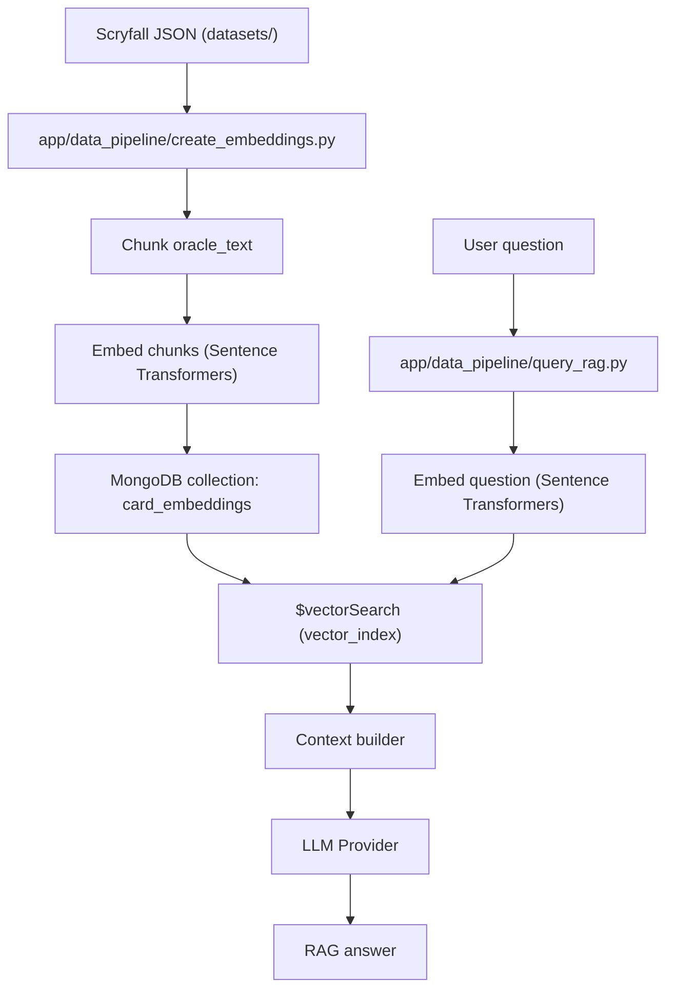
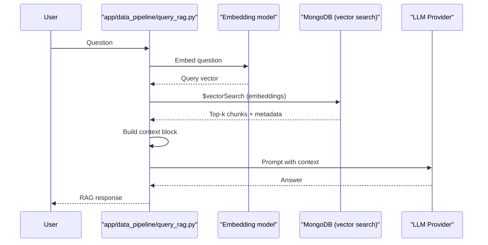

# RAG Search System

This repository implements a local RAG (Retrieval-Augmented Generation) flow for Magic: The Gathering card data. The system has two main stages: embedding ingestion and query-time retrieval/answering.

## Architecture Diagrams

### End-to-End RAG Flow



### Query-Time Retrieval Detail



## Embedding Ingestion

The ingestion pipeline lives in `scripts/create_embeddings.py` and writes chunked card data plus embeddings into MongoDB.

1. Load Scryfall JSON files from `SCRYFALL_DATASET_FILE`.
1. Normalize and select relevant fields (`name`, `type_line`, `oracle_text`, etc.).
1. Chunk `oracle_text` into token-sized slices for better recall.
1. Embed each chunk with a local Sentence Transformers model.
1. Upsert the chunk records into MongoDB with an `embeddings` field.

Embedding helper behavior:

- `scripts/embeddings.py` loads the model from a local path if it exists. Otherwise it downloads by name and saves to the path.
- Each chunk is embedded independently with `embed_text()`.
- Normalization is controlled by `NORMALIZE_EMBEDDINGS`.

## Vector Search Retrieval

The retrieval pipeline lives in `scripts/query_rag.py` and runs a vector search query against the embeddings collection.

1. Load the same embedding model used for ingestion.
1. Embed the user question into a vector.
1. Run MongoDB `$vectorSearch` on the `embeddings` field.
1. Project key fields from matching chunks for context.
1. Build a context block and pass it to an Ollama model for generation.

The query pipeline uses the index defined by `vector-index.json`:

- `database`: `mtg`
- `collectionName`: `card_embeddings`
- `path`: `embeddings`
- `numDimensions`: `384`
- `similarity`: `cosine`

## RAG Response Generation

After retrieval, the script builds a compact context block with card metadata and the matched chunk text, then prompts the configured LLM provider to produce the final answer. The context length is capped to avoid overlong prompts.

## Configuration

Key environment variables:

- `MONGODB_URI` (required)
- `MONGODB_DB` (default: `mtg`)
- `MONGODB_COLLECTION_EMBEDDINGS` (default: `card_embeddings`)
- `EMBED_MODEL_NAME` (default: `mixedbread-ai/mxbai-embed-xsmall-v1`)
- `EMBED_MODEL_PATH` (default: `models/mixedbread-ai/mxbai-embed-xsmall-v1`)
- `NORMALIZE_EMBEDDINGS` (default: `true`)
- `VECTOR_INDEX_NAME` (default: `vector_index`)
- `VECTOR_EMBED_PATH` (default: `embeddings`)
- `VECTOR_LIMIT` (default: `5`)
- `RAG_MAX_CONTEXT_CHARS` (default: `4000`)
- `LLM_PROVIDER` (default: `ollama`)
- `LLM_MODEL` (default: `mistral`)
- `LLM_TIMEOUT` (default: `120`)
- `LLM_ENDPOINT` (default: `http://127.0.0.1:11434`)

Note on search tuning:

- `scripts/query_rag.py` currently uses `"exact": True` in `$vectorSearch`. If you want approximate search, switch to `numCandidates` and remove `exact`.

## Usage

Embed a sample of cards:

```bash
python -m app.data_pipeline.create_embeddings --limit 50
```

Run a RAG query:

```bash
python -m app.data_pipeline.query_rag "Which cards care about Phyrexians?"
```
